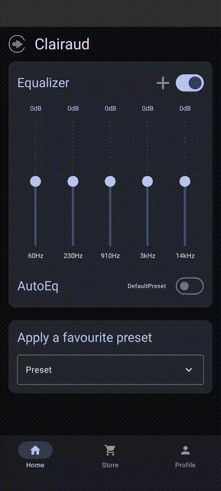
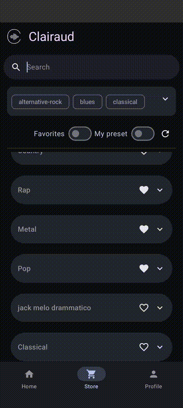
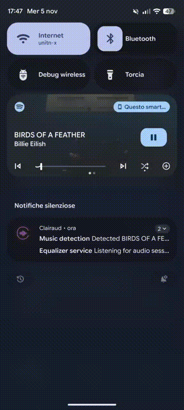

# Clairaud

Clairaud è un equalizzatore audio per dispositivi mobili android, con profili condivisibili, rilevamento automatico del genere musicale.

## Descrizione

Clairaud è un'app mobile che permette di personalizzare e migliorare l’esperienza d’ascolto musicale.  

## Funzionalità principali

- Equalizzatore audio completamente personalizzabile  
- Condivisione e download dei preset tramite community  
- Tag per categorizzare i preset (genere, cuffie, ambiente, ecc.)  
- AutoEQ: riconoscimento automatico del genere musicale

## Tecnologie utilizzate

- **Linguaggio:** Kotlin  
- **UI Framework:** Jetpack Compose  
- **Backend & Database:** Firebase (Authentication, Firestore, Storage)  
- **Audio Engine:** AndroidEqualizer (API nativa)  
- **AutoEQ:** LastFM API  

## App demo

<ul>
	<li>
		<strong>Home e applicazione preset </strong>
  		
	</li>
	<li>
		<strong>Preset condivisi dalla community</strong>
  		
	</li>
	<li>
		<strong>Funzione AutoEQ</strong>
	    
	</li>
</ul>